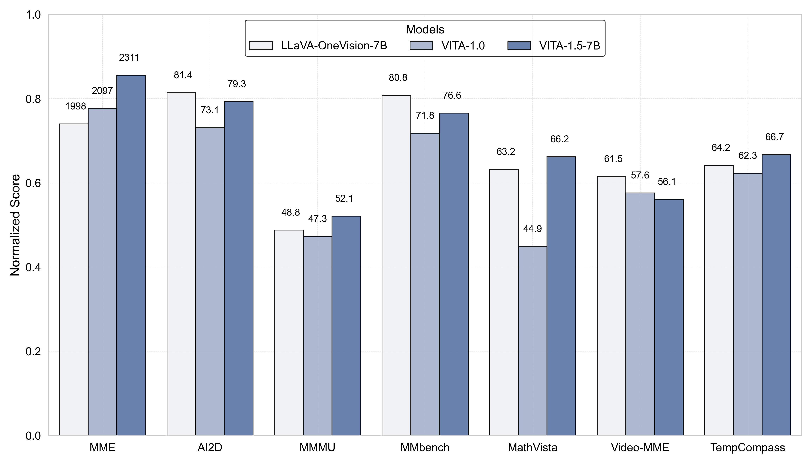
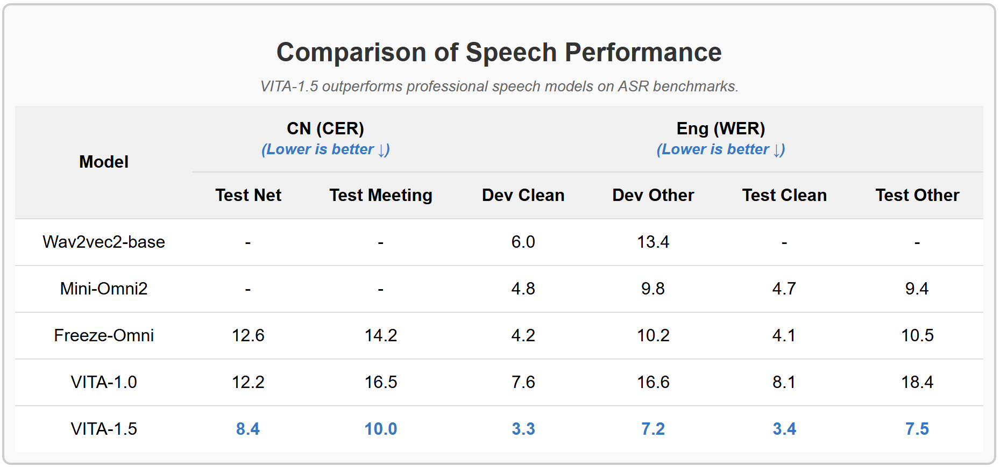
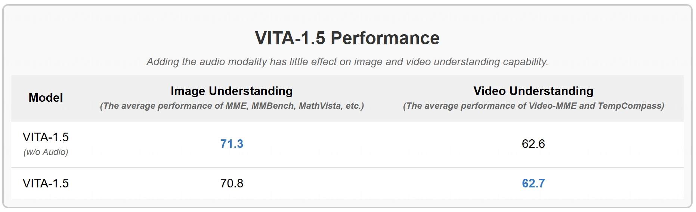

# VITA-1.5: An Open-Source Interactive Multimodal LLM


<p align="center">
    
</p>

<font size=7><div align='center' > [[📖 Paper (Comming Soon)](https://github.com/VITA-MLLM/VITA)] [[🤗 Hugging Face](https://huggingface.co/VITA-MLLM)] [[🍎 VITA-1.0](https://vita-home.github.io/)] [[💬 WeChat (微信)](./asset/wechat.jpg)]</div></font>


---

https://github.com/user-attachments/assets/d84f5576-e893-4a46-8f68-147c327c5d23

## 🔥 News
* **`2024.12.20`** 🌟 We are excited to introduce the **VITA-1.5**, a more powerful and more real-time version!
* **`2024.08.12`** 🌟 We are very proud to launch **VITA-1.0**, the First-Ever open-source interactive omni multimodal LLM! We have submitted the open-source code, yet it is under review internally. We are moving the process forward as quickly as possible, stay tuned!


## Contents <!-- omit in toc -->


- [VITA-1.5 Overview](#-vita-15-overview)
- [Experimental Results](#-experimental-results)
- [Training](#-training)
  - [Requirements and Installation](#requirements-and-installation)
  - [Data Preparation](#data-preparation)
  - [Continual Training](#continual-training)
- [Inference](#-inference)
  - [Quick Start](#quick-start)
  - [Demo](#demo)
    - [Basic Demo](#-basic-demo)
    - [Real-Time Interactive Demo](#-real-time-interactive-demo)


## 👀 VITA-1.5 Overview
On 2024.08.12, we launched **VITA-1.0**, the **first-ever open-source interactive omni-multimodal LLM**. Now (2024.12.20), we bring **a new version VITA-1.5**!

### 🌟 What’s New in VITA-1.5?

We are excited to present **VITA-1.5**, which incorporates a series of advancements:

1. **Significantly Reduced Interaction Latency**. The end-to-end speech interaction latency has been reduced from about **4 seconds** to **1.5 seconds**, enabling near-instant interaction and greatly improving user experience.  

2. **Enhanced Multimodal Performance**.  The average performance on multimodal benchmarks such as *MME*, *MMBench*, and *MathVista* has been significantly increased from **59.8** to **70.8**.

3. **Improvement in Speech Processing**. The speech processing capabilities have been refined to a new level, with ASR WER (Word Error Rate, Test Other) reduced from **18.4** to **7.5**. Besides, we replace the independent TTS module of VITA-1.0 with an **end-to-end TTS module**, which accepts the LLM's embedding as input.  

4. **Progressive Training Strategy**. By this manner, the adding of speech has little effect on other multi-modal performance (vision-language). The average image understanding performance only drops from 71.3 to 70.8.


## 📈 Experimental Results

- **Evaluation on image and video understanding benchmarks.**

<p align="center">
    
</p>

- **VITA-1.5 outperforms professional speech models on ASR benchmarks.**

<p align="center">
    
</p>

- **Adding the audio modality has little effect on image and video understanding capability**.

<p align="center">
    
</p>

## ⭐ Training
### Requirements and Installation
```
git clone https://github.com/VITA-MLLM/VITA
cd VITA
conda create -n vita python=3.10 -y
conda activate vita
pip install --upgrade pip
pip install -r requirements.txt
pip install flash-attn --no-build-isolation
```

### Data Preparation
- An example json file of the training data:
```
[
    ...
    {
        "set": "sharegpt4",
        "id": "000000000164",
        "conversations": [
            {
                "from": "human",
                "value": "<image>\n<audio>\n"
            },
            {
                "from": "gpt",  // follow the setting of llave, "gpt" is only used to indicate that this is the ground truth of the model output
                "value": "This is a well-organized kitchen with a clean, modern aesthetic. The kitchen features a white countertop against a white wall, creating a bright and airy atmosphere. "
            }
        ],
        "image": "coco/images/train2017/000000000164.jpg",
        "audio": [
            "new_value_dict_0717/output_wavs/f61cf238b7872b4903e1fc15dcb5a50c.wav"
        ]
    },
    ...
]
```

- The `set` field is used to retrieve the image or video folder for data loading. You should add its key-value pair to the `FolderDict` in [./vita/config/dataset_config.py](./vita/config/dataset_config.py):
```
AudioFolder = ""
FolderDict = {
    #### NaturalCap
    "sharegpt4": "",
}
#### NaturalCap
ShareGPT4V = {"chat_path": ""}
```

- Set the JSON path for `"chat_path"` in the corresponding dictionary in [./vita/config/dataset_config.py](./vita/config/dataset_config.py).
- Set the audio folder path for `AudioFolder` in [./vita/config/dataset_config.py](./vita/config/dataset_config.py).
- Add the data class in `DataConfig` in [./vita/config/init.py](./vita/config/__init__.py):
```
from .dataset_config import *

NaturalCap = [ShareGPT4V]

DataConfig = {
    "Pretrain_video": NaturalCap,
}
```


### Continual Training
- Download the required weights: (1) [VITA-1.5 checkpoint](https://huggingface.co/VITA-MLLM/VITA-1.5/tree/main), (2) [InternViT-300M-448px](https://huggingface.co/OpenGVLab/InternViT-300M-448px), and (3) [Our pretrained audio encoder](https://huggingface.co/VITA-MLLM/VITA-1.5/tree/main/audio-encoder-Qwen2-7B-1107-weight-base-11wh-tunning) in Stage-2 audio-language alignment (refer to Fig. 3 in the paper).

- Replace the paths in [./script/train/finetuneTaskNeg_qwen_nodes.sh](https://github.com/BradyFU/VITA-Temp/blob/main/script/train/finetuneTaskNeg_qwen_nodes.sh):
```
    ...
    --model_name_or_path VITA1.5_ckpt \
    ...
    --vision_tower InternViT-300M-448px \
    ...
    --audio_encoder audio-encoder-Qwen2-7B-1107-weight-base-11wh-tunning \
    ...
```

- Execute the following commands to start the training process:

```
export PYTHONPATH=./
export PYTORCH_CUDA_ALLOC_CONF=expandable_segments:True
OUTPUT_DIR=/mnt/cfs/lhj/videomllm_ckpt/outputs/vita_video_audio
bash script/train/finetuneTaskNeg_qwen_nodes.sh ${OUTPUT_DIR}
```


## 📐 Inference
### Quick Start
- Text query
```
CUDA_VISIBLE_DEVICES=2 python video_audio_demo.py \
    --model_path [vita/path] \
    --image_path asset/vita_log2.png \
    --model_type qwen2p5_instruct \
    --conv_mode qwen2p5_instruct \
    --question "Describe this images."
```

- Audio query
```
CUDA_VISIBLE_DEVICES=4 python video_audio_demo.py \
    --model_path [vita/path] \
    --image_path asset/vita_log2.png \
    --model_type qwen2p5_instruct \
    --conv_mode qwen2p5_instruct \
    --audio_path asset/q1.wav
```

-  Noisy audio query
```
CUDA_VISIBLE_DEVICES=4 python video_audio_demo.py \
    --model_path [vita/path] \
    --image_path asset/vita_log2.png \
    --model_type qwen2p5_instruct \
    --conv_mode qwen2p5_instruct \
    --audio_path asset/q2.wav
```


### Demo

We have accelerated the model using [vLLM](https://github.com/vllm-project/vllm). 
Since VITA has not yet been integrated into vLLM, you need to make some modifications to the vLLM code to adapt it for VITA.


```bash
conda create -n vita_demo python==3.10
conda activate vita_demo
pip install -r web_demo/web_demo_requirements.txt

# Backup a new weight file
cp -rL  VITA_ckpt/ demo_VITA_ckpt/

mv demo_VITA_ckpt/config.json demo_VITA_ckpt/origin_config.json

cd ./web_demo/vllm_tools
cp -rf qwen2p5_model_weight_file/*  ../../demo_VITA_ckpt/
cp -rf vllm_file/*  your_anaconda/envs/vita_demo/lib/python3.10/site-packages/vllm/model_executor/models/
```


#### 📍 Basic Demo

https://github.com/user-attachments/assets/43edd44a-8c8d-43ea-9d2b-beebe909377a


```bash
python -m web_demo.web_ability_demo  demo_VITA_ckpt/
```


#### 📍 Real-Time Interactive Demo

```bash
pip install flask flask-socketio cryptography timm
python -m web_demo.server --model_path demo_VITA_ckpt --ip 0.0.0.0 --port 8081
```


## 📏Evaluating on MLLM Benchmarks
### [VLMEvalkit](https://github.com/open-compass/VLMEvalKit)
Modify the model path of `vita_qwen2` in `VLMEvalKit/vlmeval/config.py`
```
vita_series = { 
    'vita': partial(VITA, model_path='/path/to/model'),
    'vita_qwen2': partial(VITAQwen2, model_path='/path/to/model'),
}
```

Follow the [instuctions in VLMEvalkit](https://github.com/open-compass/VLMEvalKit/blob/main/docs/en/Quickstart.md) to set the GPT as the judge model.

If the openai api are not available, you can use a local model as the judge. In our experiments, we find that [Qwen1.5-1.8B-Chat](https://huggingface.co/Qwen/Qwen1.5-1.8B-Chat) judge can work well compared to GPT-4, except in MM-Vet. To start the judge::
```
CUDA_VISIBLE_DEVICES=0 lmdeploy serve api_server /mnt/cfs/lhj/model_weights/Qwen1.5-1.8B-Chat --server-port 23333
```
Then, evaluating these benchmarks:
```
CUDA_VISIBLE_DEVICES=0 python run.py --data MMBench_TEST_EN_V11 MMBench_TEST_CN_V11 MMStar MMMU_DEV_VAL MathVista_MINI HallusionBench AI2D_TEST OCRBench MMVet MME --model vita_qwen2 --verbose
```

### Video-MME
#### Data Preparation
Download the [Video-MME dataset](https://github.com/BradyFU/Video-MME) and extract the frames, saving them as images to improve IO efficiency.

#### Evaluation
```
cd ./videomme
```
Run the model on Video-MME in the setting of wo/ subtitles:
```
VIDEO_TYPE="s,m,l"
NAMES=(lyd jyg wzh wzz zcy by dyh lfy)
for((i=0; i<${#NAMES[@]}; i++)) 
do
    CUDA_VISIBLE_DEVICES=6 python yt_video_inference_qa_imgs.py \
        --model-path [vita/path] \
        --model_type qwen2p5_instruct \
        --conv_mode qwen2p5_instruct \
        --responsible_man ${NAMES[i]} \
        --video_type $VIDEO_TYPE \
        --output_dir qa_wo_sub \
        --video_dir [Video-MME-imgs] | tee logs/infer.log
done

```
Run the model on Video-MME in the setting of w/ subtitles:
```
VIDEO_TYPE="s,m,l"
NAMES=(lyd jyg wzh wzz zcy by dyh lfy)
for((i=0; i<${#NAMES[@]}; i++)) 
do
    CUDA_VISIBLE_DEVICES=7 python yt_video_inference_qa_imgs.py \
        --model-path [vita/path] \
        --model_type qwen2p5_instruct \
        --conv_mode qwen2p5_instruct \
        --responsible_man ${NAMES[i]} \
        --video_type $VIDEO_TYPE \
        --output_dir qa_w_sub \
        --video_dir [Video-MME-imgs] \
        --use_subtitles | tee logs/infer.log
done
```
Parse the results:
```
python parse_answer.py --video_types "s,m,l" --result_dir qa_wo_sub
python parse_answer.py --video_types "s,m,l" --result_dir qa_w_sub
```
## ✒️ Citation

If you find our work helpful for your research, please consider citing our work.   

```bibtex
@article{fu2024vita,
  title={Vita: Towards open-source interactive omni multimodal llm},
  author={Fu, Chaoyou and Lin, Haojia and Long, Zuwei and Shen, Yunhang and Zhao, Meng and Zhang, Yifan and Wang, Xiong and Yin, Di and Ma, Long and Zheng, Xiawu and others},
  journal={arXiv preprint arXiv:2408.05211},
  year={2024}
}
```


## &#x1F4E3; Statement

**VITA is trained on large-scale open-source corpus, and its output has randomness. Any content generated by VITA does not represent the views of the model developers. We are not responsible for any problems arising from the use, misuse, and dissemination of VITA, including but not limited to public opinion risks and data security issues.**


## 📜 Related Works

Explore our related researches:
-  **[VITA-1.0]** [VITA: Towards Open-Source Interactive Omni Multimodal LLM](https://vita-home.github.io/)
-  **[Awesome-MLLM]** [A Survey on Multimodal Large Language Models](https://github.com/BradyFU/Awesome-Multimodal-Large-Language-Models)
-  **[MME]** [MME: A Comprehensive Evaluation Benchmark for Multimodal Large Language Models](https://github.com/BradyFU/Awesome-Multimodal-Large-Language-Models/tree/Evaluation)
-  **[Video-MME]** [Video-MME: The First-Ever Comprehensive Evaluation Benchmark of Multi-modal LLMs in Video Analysis](https://github.com/BradyFU/Video-MME) 


## 👍 Acknowledgement
VITA is built with reference to the following outstanding works: [LLaVA-1.5](https://github.com/haotian-liu/LLaVA), [Bunny](https://github.com/BAAI-DCAI/Bunny), [ChatUnivi](https://github.com/PKU-YuanGroup/Chat-UniVi), [InternVL](https://github.com/OpenGVLab/InternVL), [InternViT](https://huggingface.co/OpenGVLab/InternViT-300M-448px), [Qwen-2.5](https://github.com/QwenLM/Qwen2.5), [VLMEvalkit](https://github.com/open-compass/VLMEvalKit), and [Mixtral 8*7B](https://mistral.ai/news/mixtral-of-experts/).
Thanks！

